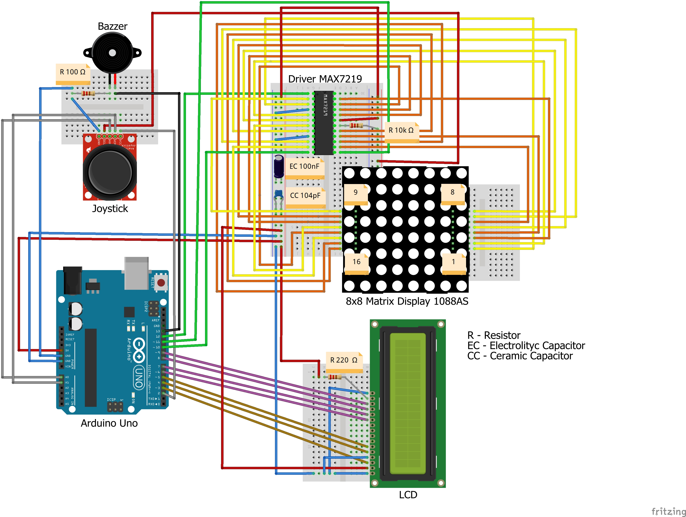

# MatrixGame_ArduinoProject
---
This is a game made on Arduino Uno, called "*Test your memory*".
---
**Game Components**:
- Arduino Uno
- Driver MAX7219
- 8x8 Matrix Display 1088AS 
- LCD 16 x 2
- Joystick
- Buzzer
- 2 x Breadboards
- 3 Resistors : *100 Ω (for buzzer), 220 Ω (for LCD), 10k Ω (for Driver)*
- 2 x Capacitors : *Electrolityc (100nF), Ceramic (104pF)*
- Wires
---
### *Here's the Fritzing Scheme*

The main idea of the game is that on the matrix are generated randomly a number of points, which the player has to remember and then 
find their place on the matrix. Initially, user has to choose the complexity type, number or time. Number complexity suppose to increase the number of points that user has to remember each level, while time complexity suppose to reduce the printing time of the points each level. When the player choose an option, the game is starting with a special sound provided by buzzer and the first level is loading.From here, every event occuring in the game has his own sound emited by the buzzer, which make a nice gaming atmosphere. 
The user has 5 lives for every level, so that, if he misses the point, he lose a live-point and if he guessed it, he will increase he's score. The game is finishing either he passed the level 10 (he passes the game) or he loses all his lives (game over). After the game is finishing, the game checks if the player has set a new record and then is asked to play again. If he decides to play again the game restarts, otherwise apears a scrolling text to the right which is simulation of the power off. In order to power on the game user has to press the button for a while (this is mentioned on the scrolling text).

https://drive.google.com/file/d/1djT2WqwJmLTHDjm_n4rEjbH16PFHNK-5/view
